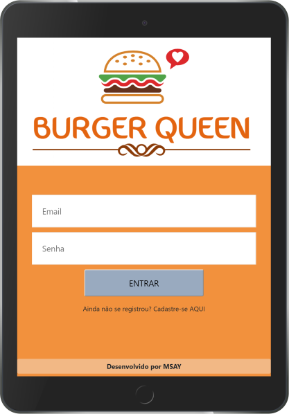
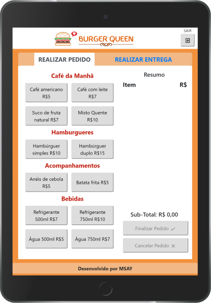
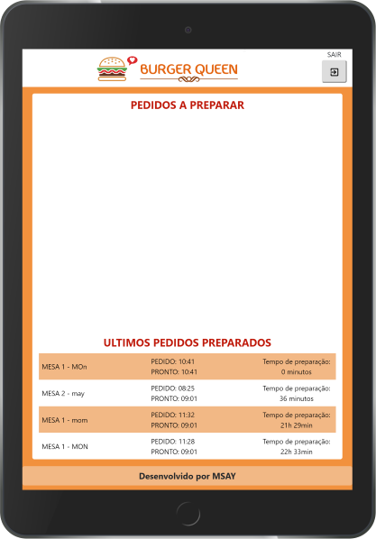
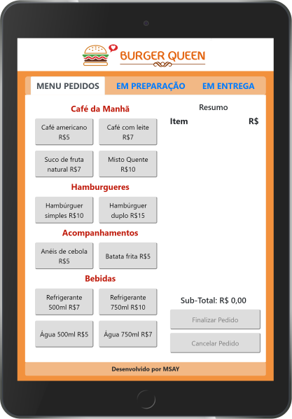

# Burger Queen

## Índice

- [1. Resumo do Projeto](#1-resumo-do-projeto)
- [2. Considerações Técnicas](#2-considerações-técnicas)
- [3. Protótipo e Teste de Usabilidade](#3-protótipo-e-teste-de-usabilidade)
- [4. Futuras Implantações](#4-futuras-implantações)
- [5. Versões Anteriores](#5-versões-anteriores)

---

## 1. Resumo do Projeto

A finalidade do projeto é a criação de uma interface para gerir os pedidos de um restaurante.

Os pedidos ao serem realizados devem ser encaminhados para a cozinha. Ao finalizar a preparação do itens, o pedido deve ser encaminhado para entrega.

Temos portanto, dois usuários distintos: quem permanece no salão, realizando e entregando os pedidos e quem prepara os pedidos na cozinha. Portanto, o login foi implantado para que o usuário possa visualizar apenas o que é relevante para a sua função.

|  |  | 

### 1.1 Funcionamento

Após realizar o login, a página é automaticamente redirecionada conforme a função cadastrada.

O usuário do salão tem duas abas de utilização:

- Menu Pedidos: O usuário pode adicionar ou excluir itens ao pedido. Ao adicionar os hamburgueres, é necessário selecionar o tipo de Hamburguer (Bovino, Frango ou Vegetariano) e opcionalmente, colocar um adicional de queijo e/ou ovo por R\$ 1,00 cada. Ao finalizar, é necessário colocar o nome do cliente e a mesa em que ele se localiza. Pode-se também excluir todo o pedido no botão cancelar.

- Em Entrega: O usuário consegue visualizar em ordem de preparação, todo os pedidos disponíveis para serem entregues. Além disso, consegue visualizar os ultimos pedidos entregues e o tempo de atendimento total (da realização do pedido até ser entregue)

O usuário da cozinha tem apenas um ambiente de utilização:

- O usuário visualiza os pedidos em ordem. Ao finalizar a preparação, o usuário deve concluir o pedido, para que seja feita a entrega. Além disso, consegue visualizar os últimos pedidos e o tempo de preparo (ao ser pedido até a finalização do preparo)

## 2. Considerações Técnicas

A aplicação foi desenvolvida para ser um _Single Page App_, sendo utilizado o [React Hooks](https://pt-br.reactjs.org/docs/hooks-intro.html). Além disso, a sua interface foi desenvolvida para ser utilizada em Tablets.

Dependencias utilizadas:

- [Firebase](https://firebase.google.com/?hl=pt-br)

- [Aphrodite](https://github.com/Khan/aphrodite)

- [React Router](https://reacttraining.com/react-router/)

- [React Bootstrap](https://react-bootstrap.github.io/)

- [Material UI Icons](https://material-ui.com/pt/components/material-icons/)

- [Babel](https://babeljs.io/)

- [webpack](https://webpack.js.org/)

## 3. Protótipo e Teste de Usabilidade

Pensando no usuário, foi desenvolvido o protótipo no [Marvel](https://marvelapp.com/dashboard/). Buscou-se uma interface limpa, clara e objetiva, com a menor quantidade de cliques para maior facilidade e agilidade.

No teste de usabilidade, foi identificado a necessidade de incluir o botão para excluir o item e cancelar todo o pedido, que foi implementado na aplicação.

## 4. Futuras Implantações

- Deixar a aplicação offline.

- Uma página gerencial, que visualiza todos os pedidos em ordem de criação e seus respectivos estados.

- Implantar testes que cubram 100% de statements, functions, lines e branches.

## 5. Versões Anteriores

versão 1.0

